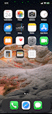

# Jobsity Challenge

Jobsity is an app based on the [iOS Challenge of Jobsity](./ios-challenge.pdf). It is an iOS native app that consumes the [TV Maze REST API](https://www.tvmaze.com/api) and implements the features mentioned on the [Features](#features) section.

## Features

### Mandatory

- [x] List all of the series contained in the API used by the paging scheme provided by the API.
- [X] Allow users to search series by name.
- [X] The listing and search views must show at least the name and poster image of the
series.
- [X] After clicking on a series, the application should show the details of the series, showing the following information:
*  Name
*  Poster
* Days and time during which the series airs
* Genres
* Summary
* List of episodes separated by season
- [X] After clicking on an episode, the application should show the episode’s information, including:
* Name
* Number
* Season
* Summary
* Image, if there is one

### Bonus

- [X] Allow the user to set a PIN number to secure the application and prevent unauthorized users.
- [X] For supported phones, the user must be able to choose if they want to enable fingerprint authentication to avoid typing the PIN number while opening the app.
- [X] Allow the user to save a series as a favorite.
- [X] Allow the user to delete a series from the favorites list.
- [X] Allow the user to browse their favorite series in alphabetical order, and click on one to
see its details.
- [X] Create a people search by listing the name and image of the person.
- [X] After clicking on a person, the application should show the details of that person, such as:
* Name
* Image
* Series they have participated in, with a link to the series details.

### Plus

- [X] Native Image Cache
- [X] Snapshot Testing

## Dependecy Management

[Swift Manager Package](https://www.swift.org/package-manager/) was the chosen for management of project dependencies, as it brings the benefit of being fully integrated with Xcode, it was a more productive work tool. Below are the dependencies of this project:

* [SnapshotTesting](https://github.com/pointfreeco/swift-snapshot-testing)

## "Future" Improvements

* Dark Mode (now it's ligh mode only);
* Continuos Integration.